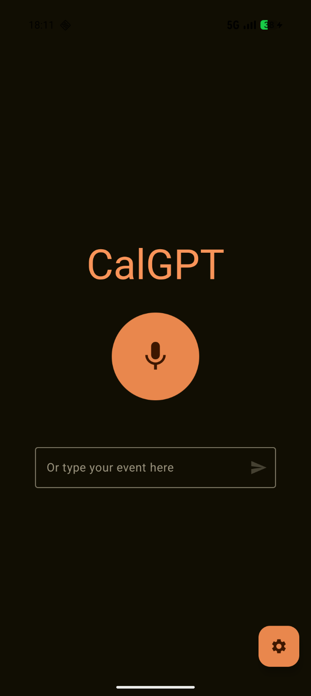
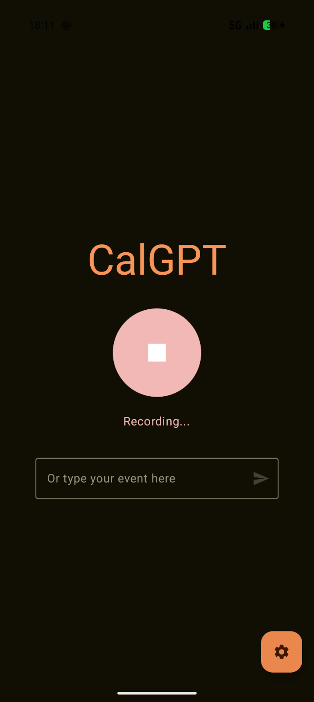
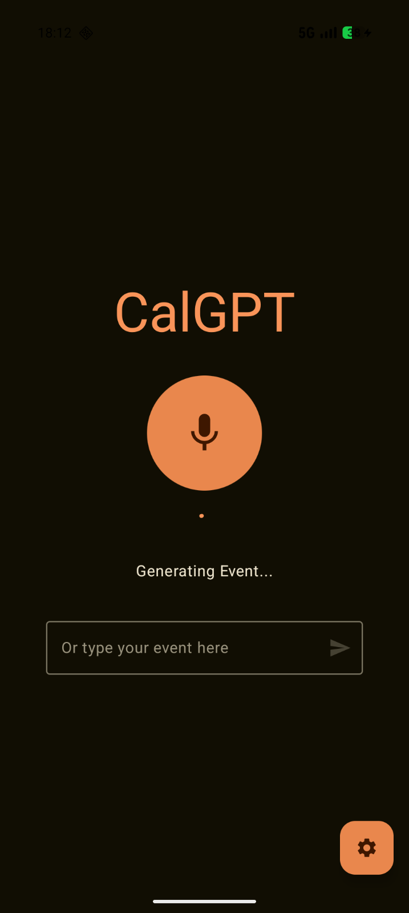
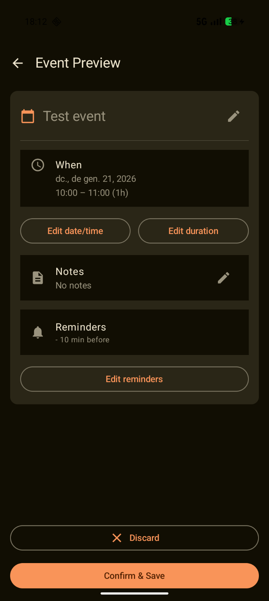
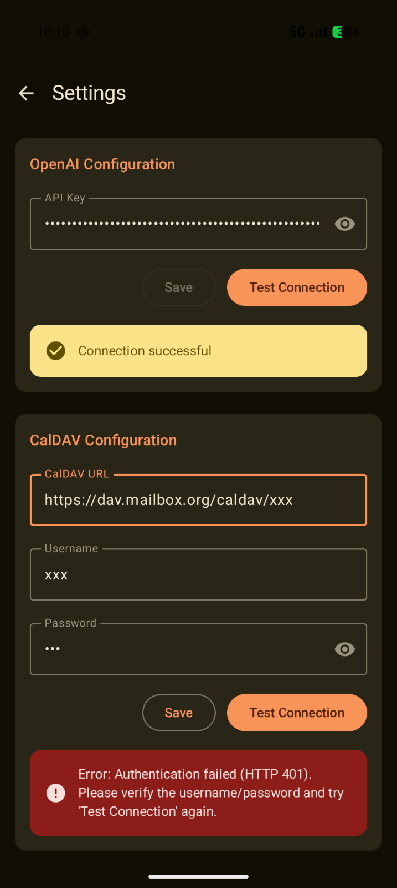

 # CalGPT
 
A few years ago I transitioned to GrapheneOS no my Android device, which I means I no longer have a voice assistant. There is one particular feature I miss which is how easy it was to ask something like "I have a meeting next Monday at 10am, remind be 1h before and 1 day before." and have my phone automatically notify me of the event. Manually introducing the event and reminders on the calendar is something I am too lazy for, which is what motivated this app.

CalGPT is an Android app that turns **voice (or text)** into a **calendar event** by using OpenAI API.
 
 The flow:
 
 1. Record audio (or type a description).
 2. Transcribe and interpret it with OpenAI.
 3. Preview (and adjust) the generated event.
 4. Send it to your calendar via **CalDAV**.
 
 ## Features
 
- Voice input and transcription
- Text input mode
- Event preview before saving
- CalDAV calendar delivery
- Settings screen with independent **OpenAI** and **CalDAV** connection tests

## Screenshots

| Main | Recording | Transcribing | Generating | Event preview | Settings |
| --- | --- | --- | --- | --- | --- |
|  |  |  |  |  |  |

## Requirements
 
- An OpenAI API key
- A CalDAV account
- A **CalDAV calendar URL** (a specific calendar URL, not just the CalDAV server base URL)

## CalDAV compatibility

CalDAV integration has only been tested with **Mailbox.org**.

You must use a CalDAV URL that points to a **specific calendar** (not a general CalDAV endpoint).
Mailbox.org documents how to obtain the correct URL and credentials here:

https://kb.mailbox.org/en/business/addressbook-and-calendar/caldav-and-carddav-for-evolution/#setup-using-the-folder-id

## Setup
 
1. Open CalGPT.
2. Go to Settings.
3. Enter your OpenAI API key and test the connection.
4. Enter your CalDAV URL/username/password and test the connection.

## Privacy & security
 
- OpenAI and CalDAV credentials are stored locally on-device.
- Audio/text you submit is sent to OpenAI for transcription/processing.
- When you confirm an event, the resulting iCalendar payload is sent to your CalDAV server.

Do not use this app with sensitive data unless you understand and accept the above.

## Build
 
Open the repository root in Android Studio.

Build a debug APK:
 
```bash
./gradlew :app:assembleDebug
```
 
Install to a connected device:
 
```bash
./gradlew :app:installDebug
```
 
## Releases (APK)
 
We publish APKs using **GitHub Releases**.
 
- Download the latest APK from the Releases page.
- On Android, you may need to allow installing unknown apps for your browser or file manager.
 
## Contributing
See [`CONTRIBUTING.md`](CONTRIBUTING.md).

## License
See [`LICENSE`](LICENSE).
